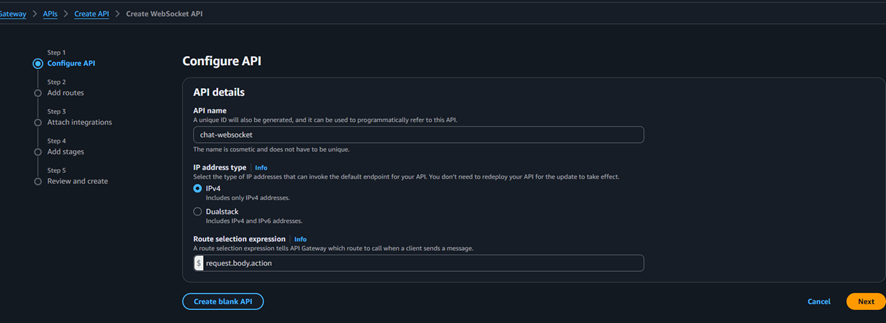
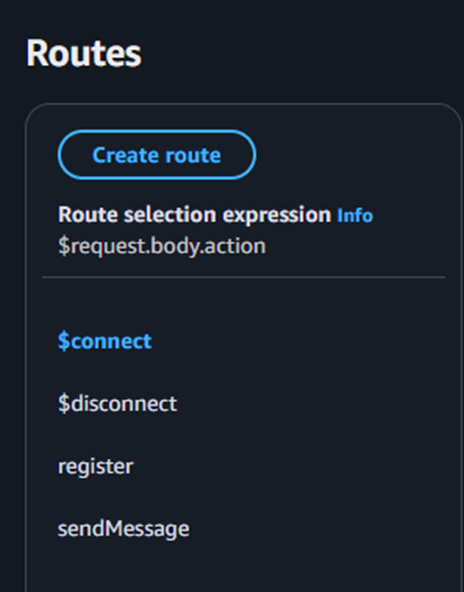

# API Gateway (WebSocket)

## Descripción

Se utiliza el servicio de API Gateway en modo **WebSocket** para permitir comunicación en tiempo real entre clientes.

A diferencia de una API REST, donde cada request es independiente, el WebSocket mantiene una conexión persistente entre el cliente y el servidor.

---

## Configuración

Se creó un WebSocket API con las siguientes rutas:

* `$connect`
* `$disconnect`
* `register`
* `sendMessage`

Cada una de estas rutas está asociada a una función Lambda.




## 🔌 Rutas del WebSocket



### $connect

Se ejecuta cuando un cliente inicia una conexión WebSocket.

* API Gateway genera automáticamente un `connectionId`
* Este evento invoca la función `connectHandler`

---

### $disconnect

Se ejecuta cuando el cliente cierra la conexión.

* Invoca la función `disconnectHandler`
* Permite eliminar conexiones activas en DynamoDB

---

### register

Ruta personalizada utilizada para registrar un usuario.

* Invoca la función `registerHandler`
* Permite asociar un `userId` con un `connectionId`

---

### sendMessage

Ruta personalizada para el envío de mensajes.

* Invoca la función `sendMessageHandler`
* Permite enviar mensajes a otros usuarios en tiempo real

---

##  Flujo de comunicación

### Conexión inicial

Cliente → API Gateway ($connect) → Lambda (connectHandler)

---

### Registro de usuario

Cliente → API Gateway (register) → Lambda (registerHandler) → DynamoDB

---

### Envío de mensajes

Cliente A → API Gateway (sendMessage) → Lambda (sendMessageHandler)

Lambda → DynamoDB (buscar usuario destino)

Lambda → API Gateway (PostToConnection)

API Gateway → Cliente B

---

## Nota 

El envío del mensaje hacia el cliente **no vuelve a ejecutar Lambda**.

Cuando la función `sendMessageHandler` utiliza:

```text
PostToConnection
```

lo que ocurre es:

```text
Lambda → API Gateway → Cliente B
```

En este paso:

* API Gateway actúa como intermediario
* Mantiene las conexiones WebSocket activas
* Entrega el mensaje directamente al cliente

Esto significa que:

* Lambda **solo procesa y decide a quién enviar**
* API Gateway **se encarga de la entrega final**

---

## Seguridad (V1)

En esta versión no se implementa autenticación.

* Los usuarios se identifican mediante un `userId` ingresado manualmente
* No existe validación de identidad
* Cualquier cliente podría suplantar a otro usuario

---

##  Limitaciones

* No hay autenticación ni autorización
* No se utilizan Authorizers
* No hay validación de mensajes
* Dependencia de `Scan` en DynamoDB para buscar usuarios

---

## 🚀 Próximas mejoras (V2)

* Integración con Amazon Cognito
* Uso de JWT para autenticación
* Implementación de WebSocket Authorizers
* Validación de identidad de usuarios
* Mejora del modelo de datos en DynamoDB (uso de GSI)

---

## Conceptos clave

* WebSocket permite comunicación bidireccional en tiempo real
* API Gateway gestiona conexiones persistentes
* `connectionId` identifica cada cliente conectado
* `PostToConnection` permite enviar mensajes a conexiones específicas
