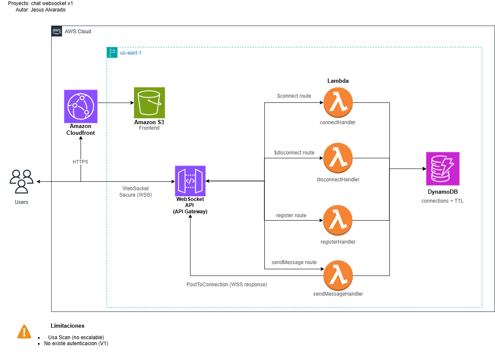

# Arquitectura del sistema

## Descripción general

Este proyecto implementa un sistema de chat en tiempo real utilizando una arquitectura serverless en AWS.

El sistema permite comunicación entre usuarios mediante WebSockets, manteniendo una conexión persistente para el envío y recepción de mensajes.

---

## Componentes principales

* Amazon CloudFront
* Amazon S3
* API Gateway (WebSocket)
* AWS Lambda
* DynamoDB

---

## Diagrama de arquitectura



---

## Flujo de alto nivel

El sistema se divide en dos flujos principales:

### 1. Entrega del frontend

```text
User → CloudFront → S3
```

* CloudFront distribuye el contenido estático
* S3 almacena el frontend (`index.html`)
* El acceso directo a S3 está bloqueado

---

### 2. Comunicación en tiempo real

```text
User → API Gateway (WSS) → Lambda → DynamoDB
Lambda → API Gateway → User
```

* El navegador establece una conexión WebSocket (WSS)
* API Gateway gestiona la conexión persistente
* Lambda procesa los eventos
* DynamoDB almacena conexiones activas

---

##  Decisiones de diseño

### Separación de flujos (frontend vs tiempo real)

Se separó la entrega del frontend y la comunicación WebSocket para:

* Reducir acoplamiento
* Permitir escalabilidad independiente
* Mantener una arquitectura más clara

---

### Uso de API Gateway WebSocket

Se eligió WebSocket en lugar de REST para:

* Mantener conexiones persistentes
* Permitir comunicación bidireccional en tiempo real
* Evitar polling o requests repetitivos

---

### Uso de DynamoDB

DynamoDB se utiliza como almacenamiento de conexiones activas:

* Guarda `connectionId` y `userId`
* Permite ubicar usuarios para envío de mensajes
* Usa TTL para limpiar conexiones inactivas

---

### Uso de CloudFront + S3

Se utiliza CloudFront delante de S3 para:

* Servir contenido mediante HTTPS
* Mejorar latencia (CDN)
* Evitar exponer el bucket directamente

---

### Uso de Lambda

Lambda permite:

* Procesar eventos sin servidores
* Escalar automáticamente
* Reducir costos operativos

---

## Limitaciones de la arquitectura (V1)

* Uso de `Scan` en DynamoDB (no escalable)
* No existe autenticación ni autorización
* Los `userId` son definidos manualmente
* No hay validación de mensajes
* Dependencia de WebSocket API sin control avanzado de identidad

---

## Evolución propuesta (V2)

Para una versión más robusta se propone:

* Integrar Amazon Cognito para autenticación
* Uso de JWT para validar identidad
* Implementar WebSocket Authorizers
* Reemplazar `Scan` por consultas optimizadas (GSI)
* Mejorar modelo de datos en DynamoDB
* Implementar validación de mensajes

---

## Consideraciones importantes

* API Gateway mantiene las conexiones WebSocket activas
* Lambda no participa en la entrega final del mensaje
* CloudFront no maneja tráfico WebSocket en esta arquitectura
* El sistema está diseñado como una arquitectura serverless desacoplada

---

## Resumen

Esta arquitectura permite implementar un sistema de chat en tiempo real utilizando servicios serverless de AWS, con un diseño simple, escalable y desacoplado, adecuado como base para una solución más robusta en futuras versiones.
