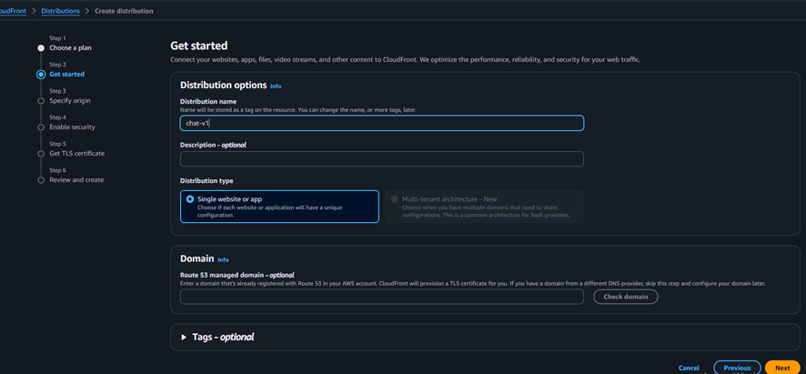
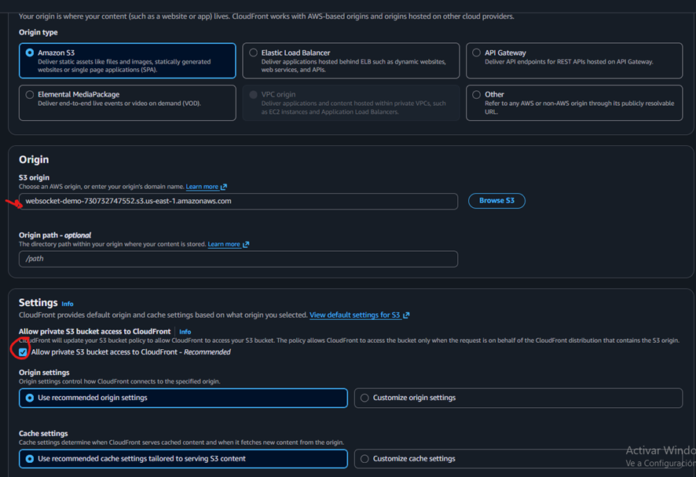
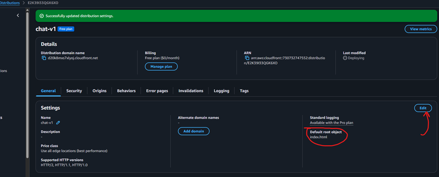

# CloudFront

## Descripción

Se utiliza Amazon CloudFront como CDN (Content Delivery Network) para distribuir el frontend de la aplicación de forma segura mediante HTTPS.

CloudFront permite servir contenido estático desde S3 con baja latencia y mejorar la seguridad al no exponer directamente el bucket.



---

## Configuración

Se creó una distribución de CloudFront con:

* Origen: bucket S3 que contiene el frontend (`index.html`)
* Default Root Object: `index.html`
* Viewer Protocol Policy: Redirect HTTP to HTTPS
* Uso de Origin Access Control (OAC)




---

## Integración con S3

CloudFront utiliza el bucket S3 como origen para servir los archivos estáticos.

```text
User → CloudFront → S3
```

El acceso directo al bucket S3 está bloqueado, permitiendo únicamente el acceso desde CloudFront.

---

##  Seguridad

Para mejorar la seguridad:

* Se bloqueó el acceso público al bucket S3
* Se configuró una policy que permite acceso solo desde CloudFront
* Se utilizó Origin Access Control (OAC)

Esto evita que los usuarios accedan directamente a S3 y obliga a pasar por CloudFront.

---

##  HTTPS

CloudFront permite servir el contenido mediante HTTPS.

Esto es importante porque:

* Los navegadores modernos (especialmente en dispositivos móviles) bloquean contenido HTTP
* El frontend necesita comunicarse con el WebSocket API usando WSS (WebSocket Secure)

---

## Relación con WebSocket API

CloudFront **NO maneja el tráfico WebSocket** en esta arquitectura.

El flujo real es:

```text
User → CloudFront → S3 (frontend)
User → API Gateway (WSS) (WebSocket)
```

Esto significa que:

* CloudFront solo entrega el frontend
* El navegador (JavaScript) establece la conexión WebSocket directamente con API Gateway

---

##  Consideraciones

* CloudFront no actúa como proxy del WebSocket en esta versión
* El contenido es cacheado, por lo que cambios en el frontend pueden requerir invalidación
* El despliegue de cambios puede tardar algunos minutos

---

##  Próximas mejoras (V2)

* Uso de dominio personalizado (Route 53)
* Integración con certificados SSL personalizados (ACM)
* Configuración de cache-control más avanzado
* Posible integración más compleja con APIs

---

## Conceptos clave

* CloudFront es un CDN global
* Permite servir contenido estático de forma segura y eficiente
* Mejora la experiencia del usuario al reducir latencia
* Se integra con S3 como origen
* Usa HTTPS por defecto
