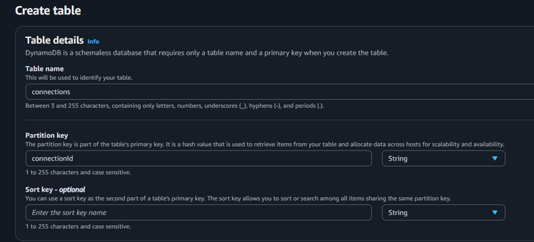
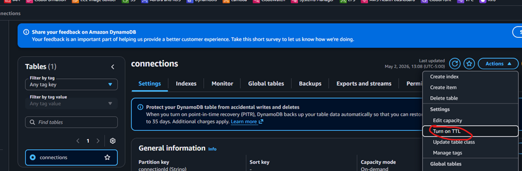
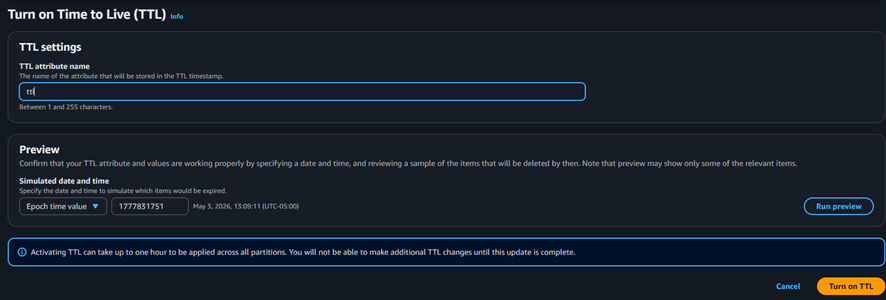

# DynamoDB Setup

## Descripción
Creamos una tabla usando el servicio DynamoDB para almacenar las conexiones activas de los usuarios.

## Estructura

- Table name: connections
- Primary key: connectionId (String)
- Attributes:
  - userId
  - ttl

## Notas

DynamoDB funciona como base de datos NoSQL tipo clave-valor y documento. Esto quiere decir que guarda datos en formato JSON (tipo documento) y se accede a ellos usando una Primary Key, que en este caso es connectionId. Habilitamos TTL para que se elimine automáticamente las conexiones inactivas:

