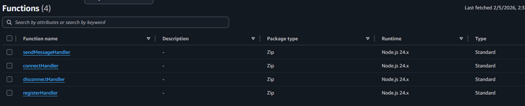

# Lambda Setup

## Descripción
Creamos 4 funciones lambda que están asociadas a rutas del WebSocket API Gateway.
Cada ruta ejecuta una función específica dependiendo del tipo de evento. 

## Estructura / Funciones

### connectHandler: 
Se ejecuta cuando un cliente establece una conexión WebSocket ($connect). Recibe un connectionId generado automáticamente por AWS API Gateway. Cada vez que alguien se conecta, guarda su ID en la tabla DynamoDB connections para registrar la conexión activa. 

### disconnectHandler:
Se ejecuta cuando el cliente cierra la conexión ($disconnect).Recibe el connectionId y elimina la conexión de DynamoDB. Este proceso no siempre es inmediato (por eso también se usa TTL como respaldo).

### registerHandler:
Se usa cuando el cliente envía su userId después de conectarse. Esta función recibe el connectionId, el userId (que el usuario ingresa en la página web y se envía desde el frontend) y finalmente los asocia y guarda esta relación en la tabla DynamoDB. Su principal función es identificar a los usuarios para enviar mensajes 1 a 1.

### sendMessageHandler: 
Se encarga de enviar mensajes. Cuando un cliente envía un mensaje (sendMessage route), este recibe el mensaje, el destino y connectionId del emisor. Luego se encarga de obtener todas las conexiones desde DynamoDB (usando Scan) y busca el connectionId del usuario destino. Finalmente envía el mensaje usando el API Gateway Management API.

#### Flujo:
Cliente A → API Gateway → Lambda

Lambda → DynamoDB (buscar usuario)

Lambda → API Gateway (PostToConnection)

API Gateway → Cliente B

#### Nota importante sobre el flujo

El mensaje de retorno hacia el cliente **no vuelve a ejecutar ninguna función Lambda**.

El flujo funciona de la siguiente manera:

- El cliente A envía un mensaje → API Gateway invoca la función Lambda (`sendMessageHandler`)
- La función Lambda procesa el mensaje y utiliza `PostToConnection`
- API Gateway se encarga de entregar el mensaje directamente al cliente B

Es decir: 

Lambda → API Gateway → Cliente B

En este último paso, **API Gateway actúa como intermediario** y mantiene la conexión WebSocket activa.

Esto es importante porque:

- Lambda **no está en el camino de entrega final**
- API Gateway funciona como un **broker de conexiones WebSocket**
- El cliente receptor maneja el mensaje directamente en el frontend (`onmessage`)

Este comportamiento permite que la comunicación sea eficiente y en tiempo real sin necesidad de ejecutar más funciones Lambda.

Para el envío del mensaje se utiliza: PostToConnectionCommand. Esto permite enviar mensajes a una conexión WebSocket específica.

Como manejo de errores, si la conexión ya no existe (HTTP 410) entonces se elimina automáticamente de DynamoDB.

## Notas

Handler es la función principal que Lambda ejecuta.
Las funciones necesitan un rol para poder acceder a ingresar los ids en la tabla dynamo, crear logs y usar el API Gateway. El rol puede tener el nombre "proyecto_chat_V1" y debe tener las siguientes policies (también se encuentran en la carpeta lambda-role-policies):

>[!TIP]
>
>Las siguientes políticas json están en la carpeta *lambda-role-policies*

{
    "Version": "2012-10-17",
    "Statement": [
        {
            "Effect": "Allow",
            "Action": "logs:CreateLogGroup",
            "Resource": "arn:aws:logs:us-east-1:730732747552:*"
        },
        {
            "Effect": "Allow",
            "Action": [
                "logs:CreateLogStream",
                "logs:PutLogEvents"
            ],
            "Resource": [
                "arn:aws:logs:us-east-1:730732747552:log-group:/aws/lambda/*"
            ]
        }
    ]
}

{
    "Version": "2012-10-17",
    "Statement": [
        {
            "Sid": "DynamoAccess",
            "Effect": "Allow",
            "Action": [
                "dynamodb:PutItem",
                "dynamodb:DeleteItem",
                "dynamodb:Scan"
            ],
            "Resource": "arn:aws:dynamodb:us-east-1:730732747552:table/connections"
        }
    ]
}

{
    "Version": "2012-10-17",
    "Statement": [
        {
            "Sid": "AccesoApiGateway",
            "Effect": "Allow",
            "Action": "execute-api:ManageConnections",
            "Resource": "*"
        }
    ]
}

>[!WARNING]
> Se tienen las siguientes limitaciones

- Uso de Scan en DynamoDB (no escalable)
- No hay autenticación (userId manual)
- No hay validación de identidad

Todo ello se plantea mejorar en una segunda versión con el uso de cognito, JWT y otros servicios para mejorar la seguridad y escalabilidad.